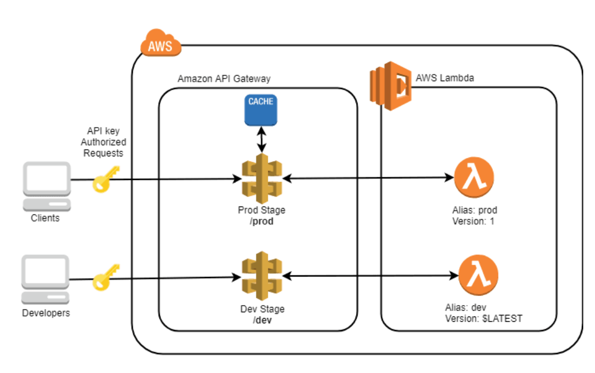

# RESTful-Microservice-
RESTful microservice using AWS Lambda

Amazon API gateway allows to design RESTful interfaces and connect them to your favorite backend.
You can design your own resurces structure, add dunamic routing parameters, and develop custom auth logic.
Each API resource can be configured independently, while each stage can have specific cache, throttling and logging configurations.

This approach is particularly useful when you consider that each request and response can be attached to a custom mapping template, in order to perform custom data manipulation or improe the API backward compatibility.

In this project, we will define a simple API and connect to AWS Lambda. This provies a nice way to obtain a scalable backend for modern web apps or mobile apps.
You will configure custom stages, project resources with an API key, and explain how to best connect API gateway stages with AWS lambda versions and aliases.
A part of this project would also be to learn about the Lambda's basic configuration, monitoring and versioning.

Objectives of this project : 
Understand the basics of RESTful APIs
Implement REST APIs using Amazon API Gateway
Enable desirable API features in API Gateway including caching, throttling, CORS, usage plans, and API key access
Create serverless API backends using AWS Lambda functions
Implement best practices for integrating Lambda backends in API Gateway
